<div align="center">

# MCParr AI Gateway

**AI-powered homelab management with MCP server and web administration**

[](LICENSE)
[](https://hub.docker.com/r/sharkhunterr/mcparr)
[](https://python.org)
[](https://fastapi.tiangolo.com)
[](https://reactjs.org)
[](#-internationalization)

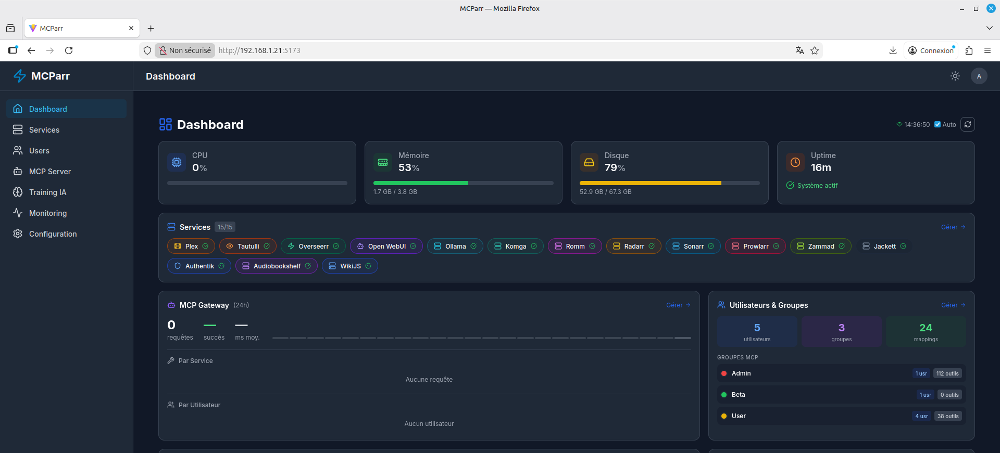

[Features](#-features) •
[Quick Start](#-quick-start) •
[Documentation](#-documentation) •
[Screenshots](#-screenshots)

</div>

---

> [!WARNING]
> **Vibe Code Project** - This application was built **100% using AI-assisted development** with [Claude Code](https://claude.ai/claude-code) (Anthropic's CLI). See [Project Story](#project-story) for details on why and how.

---

MCParr is your unified gateway for managing homelab services through AI. Built with FastAPI and React, it combines a powerful MCP (Model Context Protocol) server with a modern web interface for seamless AI-driven automation.

## Project Story

### Why "MCParr"?

The name **MCParr** combines two key concepts:
- **MCP** (Model Context Protocol) - The protocol that connects AI assistants to external tools
- **\*arr** - A reference to the popular homelab suite (Rad**arr**, Son**arr**, Prowl**arr**, etc.)

MCParr is the bridge between AI and your media center, allowing natural language control of your entire homelab ecosystem.

### The Need
As a homelab enthusiast managing services for family and friends, I found myself constantly receiving messages for simple requests: "Can you add this movie?", "I can't find that show", "Can you create my account?". Each request required manual intervention and back-and-forth communication.

**The Goal**: Provide an AI assistant (via Open WebUI) that could handle all these requests autonomously, allowing my users to interact directly with the homelab without requiring my intervention for every small task.

### Why Vibe Code?
This project was developed **100% using Claude Code (Anthropic's CLI) and GitHub's Spec-Kit** for a simple reason: **lack of time and technical expertise, but a growing need to do things right**.

As my homelab grew, so did the complexity and the number of user requests. I needed a robust, maintainable solution but lacked:
- Deep knowledge of FastAPI, React, and modern web development
- Time to learn all the best practices and architectural patterns
- Experience with AI integration and MCP protocol

The result is a fully functional, well-documented homelab management platform that would have been impossible to build alone in a reasonable timeframe. This demonstrates how AI-assisted development can democratize software creation, allowing anyone with a vision to build complex systems regardless of their initial skill level.

## Features

**Setup Wizard & Configuration**
- Interactive first-time setup wizard
- Import/export complete configuration
- Guided step-by-step service configuration
- One-click data reset with wizard restart option

**Unified Service Management**
- Configure and control 15+ homelab services (Plex, Radarr, Sonarr, Overseerr, Prowlarr, etc.)
- Centralized configuration and monitoring
- Real-time health checks and status

**Real-time Observability**
- Live logs with WebSocket streaming
- System metrics and performance monitoring
- Alert management with customizable rules
- Correlation IDs for request tracing

**AI Training & Integration**
- Custom Ollama model training with GPU support
- Training progress tracking and session management
- MCP server for AI-powered homelab automation
- Open WebUI compatible tools

**User Management**
- Automatic user mapping across services
- Centralized identity management
- Group-based permissions for AI tools
- Service-specific authentication

**Developer Friendly**
- Complete REST API with OpenAPI documentation
- WebSocket endpoints for real-time updates
- Comprehensive logging and observability
- Prometheus-compatible metrics

**Extensible Architecture**
- Add new services via adapter pattern ([Integration Guide](docs/INTEGRATION_GUIDE.md))
- Modular design for custom service integrations
- Full i18n support for new features

## Architecture


### Technology Stack

<table>
<tr>
<td width="50%">

**Backend**
- Python 3.11+ with FastAPI
- SQLAlchemy ORM + Alembic migrations
- Redis for caching
- WebSocket for real-time updates
- 15+ service adapters
- MCP server implementation

</td>
<td width="50%">

**Frontend**
- React 18 + TypeScript
- Tailwind CSS + shadcn/ui
- Recharts for visualization
- Real-time WebSocket integration
- Responsive dark/light themes

</td>
</tr>
</table>

## Internationalization

MCParr is fully translated into **5 languages**:

| Language | Code | Status |
|----------|------|--------|
| English | `en` | Complete |
| French | `fr` | Complete |
| German | `de` | Complete |
| Spanish | `es` | Complete |
| Italian | `it` | Complete |

### Translation Tools

Translations are managed using [react-i18next](https://react.i18next.com/) with JSON locale files. All translations were generated with assistance from **Claude Code**.

### Contributing Translations

Want to add a new language? Here's how:

1. **Fork the repository**
2. **Create a new locale folder**: `src/frontend/src/i18n/locales/{lang_code}/`
3. **Copy English files** from `en/` folder as templates
4. **Translate** all JSON files (common.json, mcp.json, training.json, etc.)
5. **Register the language** in `src/frontend/src/i18n/index.ts`
6. **Submit a Pull Request**

The locale files are in `src/frontend/src/i18n/locales/`. Each namespace (common, mcp, training, users, etc.) has its own JSON file.

## Requirements

### For Docker Deployment (Recommended)
- Docker 24+
- Docker Compose 2.20+
- 4GB RAM minimum
- 10GB disk space

### For Local Development
- Python 3.11+
- Node.js 20+ (Vite requirement)
- Poetry (Python dependency management)
- SQLite (default) or PostgreSQL

## Quick Start

### Docker Deployment (Production)

```bash
# Pull and run the unified Docker image
docker pull sharkhunterr/mcparr:latest

# Using Docker Compose (recommended)
curl -o docker-compose.yml https://raw.githubusercontent.com/sharkhunterr/mcparr/master/docker/docker-compose.yml
docker compose up -d

# Or via npm scripts
npm run docker        # Build and start
npm start            # Start in production mode
npm stop             # Stop services
npm run logs         # View logs
```

### Local Development

```bash
# Setup (first time only - installs Poetry and dependencies)
npm run setup

# Start backend and frontend concurrently
npm run dev

# Or start separately
npm run dev:backend   # Backend on port 8000
npm run dev:frontend  # Frontend on port 3000

# Testing and linting
npm test              # Run all tests
npm run lint          # Run all linters
npm run fix           # Auto-fix linting issues
npm run reports       # Generate test/lint reports
```

### Access Your Gateway

- **Web UI**: http://localhost:3000
- **API Docs**: http://localhost:8000/docs
- **ReDoc**: http://localhost:8000/redoc
- **MCP Server**: http://localhost:8001

## First-Time Setup Wizard

When you first access MCParr, you'll be greeted with an interactive setup wizard that guides you through the initial configuration:

### Wizard Features

**1. Welcome Screen**
- Option to import an existing configuration (skip all manual setup)
- Or start fresh with guided configuration

**2. Guided Steps**
- **Services**: Configure your homelab services (Plex, Radarr, Sonarr, etc.)
- **User Mapping**: Automatic user discovery across all services
- **Groups & Permissions**: Set up access control for AI tools
- **Information Pages**: Learn about MCP, Training, Monitoring, and Configuration features

**3. Configuration Import/Export**
- **Import at Welcome**: Upload a backup file to restore complete configuration
- **Export Anytime**: Backup your entire setup (services, users, groups, prompts, settings)
- **Selective Restore**: Choose which data categories to import
- **Merge Mode**: Import without overwriting existing data

**4. Data Reset**
- Complete application reset via Configuration → Backup tab
- Double confirmation to prevent accidental deletion
- Option to launch wizard after reset
- Deletes all services, user mappings, groups, training prompts, and settings

### Skip or Complete Later
- Click "Skip" to access the interface immediately
- Wizard completion is saved - it won't show again after first setup
- Access wizard anytime via Configuration → General → "Reset wizard"

## Documentation

- [Installation Guide](docs/INSTALLATION.md) - Complete installation and setup
- [Configuration Guide](docs/CONFIGURATION.md) - Environment variables and service config
- [API Reference](docs/API.md) - REST API endpoint documentation
- [MCP Integration](docs/MCP.md) - Connect to Claude Desktop and AI assistants
- [User Guide](docs/USER_GUIDE.md) - End-user documentation
- [Integration Guide](docs/INTEGRATION_GUIDE.md) - Add new services to MCParr

## Supported Services

MCParr integrates with 15+ homelab services. Each tool returns clickable URLs to open items directly in the service web interface.

### Media Management

| Service | Description | MCP Tools | Actions |
|---------|-------------|-----------|---------|
| 🎬 Plex | Media server | `plex_get_libraries`, `plex_search_media`, `plex_get_recently_added`, `plex_get_on_deck`, `plex_get_media_details`, `plex_get_active_sessions` | Search content, list libraries, view sessions, get recently added (with links) |
| 🎫 Overseerr | Request management | `overseerr_search_media`, `overseerr_get_requests`, `overseerr_request_media`, `overseerr_get_trending`, `overseerr_check_availability`, `overseerr_get_users`, `overseerr_get_statistics` | Request movies/TV, check availability (with TMDB links) |
| 🎥 Radarr | Movie automation | `radarr_get_movies`, `radarr_search_movie`, `radarr_get_queue`, `radarr_get_calendar`, `radarr_get_statistics`, `radarr_get_indexers`, `radarr_test_indexer`, `radarr_test_all_indexers` | Manage movies, search, view queue/calendar (with TMDB/IMDB links) |
| 📺 Sonarr | TV automation | `sonarr_get_series`, `sonarr_search_series`, `sonarr_get_queue`, `sonarr_get_calendar`, `sonarr_get_statistics`, `sonarr_get_indexers`, `sonarr_test_indexer`, `sonarr_test_all_indexers` | Manage series, search, view queue/calendar (with TVDB/IMDB links) |
| 📊 Tautulli | Plex analytics | `tautulli_get_activity`, `tautulli_get_history`, `tautulli_get_users`, `tautulli_get_libraries`, `tautulli_get_statistics`, `tautulli_get_recently_added`, `tautulli_get_server_info`, `tautulli_get_top_users`, `tautulli_get_top_movies`, `tautulli_get_top_tv_shows`, `tautulli_get_top_music`, `tautulli_get_top_platforms`, `tautulli_get_user_stats`, `tautulli_get_watch_stats_summary` | View activity, history, stats, top users/content (with Plex links) |
| 🔍 Prowlarr | Indexer manager | `prowlarr_get_indexers`, `prowlarr_search`, `prowlarr_get_indexer_stats`, `prowlarr_get_applications`, `prowlarr_get_statistics`, `prowlarr_test_indexer`, `prowlarr_test_all_indexers` | Search across indexers, manage and test indexers |

### Downloads & Storage

| Service | Description | MCP Tools | Actions |
|---------|-------------|-----------|---------|
| ⬇️ Deluge | Torrent client | `deluge_get_torrents`, `deluge_add_torrent`, `deluge_pause_torrent`, `deluge_resume_torrent`, `deluge_remove_torrent`, `deluge_get_statistics` | Manage torrents, add/pause/resume/remove, view stats |
| 🔎 Jackett | Torrent indexer | `jackett_get_indexers`, `jackett_search`, `jackett_test_indexer`, `jackett_get_statistics`, `jackett_test_all_indexers` | Search across indexers, test and manage indexers |

### Books & Games

| Service | Description | MCP Tools | Actions |
|---------|-------------|-----------|---------|
| 📚 Komga | Comics/Manga | `komga_get_libraries`, `komga_get_series`, `komga_get_books`, `komga_search`, `komga_get_users`, `komga_get_statistics` | Browse libraries, series, books (with reader links) |
| 🎧 Audiobookshelf | Audiobooks | `audiobookshelf_get_libraries`, `audiobookshelf_get_library_items`, `audiobookshelf_get_item`, `audiobookshelf_search`, `audiobookshelf_get_users`, `audiobookshelf_get_listening_stats`, `audiobookshelf_get_media_progress`, `audiobookshelf_get_statistics` | Manage audiobooks, track progress (with player links) |
| 🎮 RomM | ROM manager | `romm_get_platforms`, `romm_get_roms`, `romm_search_roms`, `romm_get_collections`, `romm_get_users`, `romm_get_statistics` | Browse platforms, ROMs, collections (with game links) |

### Utilities & Infrastructure

| Service | Description | MCP Tools | Actions |
|---------|-------------|-----------|---------|
| 📖 Wiki.js | Documentation | `wikijs_get_pages`, `wikijs_get_page`, `wikijs_search`, `wikijs_get_page_tree`, `wikijs_get_tags`, `wikijs_get_users`, `wikijs_get_statistics`, `wikijs_create_page` | Search/browse/create wiki pages (with page links) |
| 🎫 Zammad | Ticketing | `zammad_get_tickets`, `zammad_get_ticket_details`, `zammad_search_tickets`, `zammad_create_ticket`, `zammad_add_comment`, `zammad_update_ticket_status`, `zammad_get_ticket_stats` | Manage tickets, create/update/comment (with ticket links) |
| 🔐 Authentik | Identity | `authentik_get_users`, `authentik_get_user`, `authentik_search_users`, `authentik_get_groups`, `authentik_get_applications`, `authentik_get_events`, `authentik_get_statistics`, `authentik_get_server_info`, `authentik_deactivate_user` | Manage users, groups, applications, view events |
| 💬 Open WebUI | AI interface | `openwebui_get_status`, `openwebui_get_users`, `openwebui_get_models`, `openwebui_get_chats`, `openwebui_get_statistics`, `openwebui_search_users` | Manage AI models, chats, users |

> **Note**: Adding new services requires development work. See the [Integration Guide](docs/INTEGRATION_GUIDE.md) for details on implementing new service adapters.

## AI Integration with Open WebUI

MCParr is designed to work seamlessly with **Open WebUI**, providing a ChatGPT-like interface to control your entire homelab through natural language.

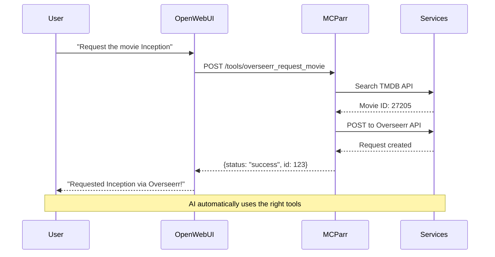

### Quick Setup with Open WebUI

**1. Install Open WebUI (if not already installed)**

```bash
docker run -d -p 3000:8080 \
  -v open-webui:/app/backend/data \
  --name open-webui \
  ghcr.io/open-webui/open-webui:main
```

**2. Add MCParr Tools to Open WebUI**

In Open WebUI:
1. Go to **Settings** → **Admin Settings** → **Tools**
2. Click **"+ Add Tool"**
3. Configure the connection:
   - **Type**: Select **"OpenAPI"**
   - **URL**: `http://YOUR_MCPARR_HOST:8000` (replace with your MCParr IP/hostname)
   - **OpenAPI Spec**: Select `/tools/openapi.json` from dropdown
   - **Auth**: Select **"Session"**
   - **Username**: Give it a descriptive name like "MCParr Homelab Tools"
   - **Visibility**: Choose **"Public"** to share with all users
4. Click **Save** to add the tools

**Important Notes:**
- Use `localhost` if Open WebUI is running on the same machine
- Use `host.docker.internal` if Open WebUI is in Docker on macOS/Windows
- On Linux with Docker, use your machine's IP address (e.g., `192.168.1.21`)
- The port is `8000` (API port), not `8001` (MCP port)

**3. Enable Tools in Chat**

1. Start a new chat in Open WebUI
2. Click the **tools icon** (wrench) in the chat input bar
3. Enable the MCParr tools you want to use
4. Start chatting! The AI can now control your homelab

**4. Example Conversations**

```
You: What movies do I have about space?
AI: [Searches Plex] You have 23 space movies including Interstellar, The Martian...

You: Request the new season of Foundation
AI: [Uses Overseerr] I've requested Foundation Season 2 for you!

You: How are my downloads?
AI: [Checks Radarr/Sonarr] You have 3 movies and 5 episodes downloading...
```

### Other AI Assistants

MCParr also works with Claude Desktop and other MCP-compatible assistants.

**Claude Desktop Configuration:**

Add to `~/.config/claude/claude_desktop_config.json`:

```json
{
  "mcpServers": {
    "mcparr": {
      "command": "curl",
      "args": ["-N", "http://YOUR_MCPARR_HOST:8001/sse"]
    }
  }
}
```

### Available MCP Tools

Once connected, AI assistants can:
- **Search Plex** libraries for movies, TV shows, music
- **Request media** via Overseerr with automatic quality selection
- **Manage downloads** in Radarr, Sonarr, Prowlarr
- **Control torrents** in Deluge
- **Browse libraries** in Komga, Audiobookshelf, ROMM
- **Create tickets** in Zammad
- **Manage users** in Authentik
- **Search documentation** in Wiki.js
- **Interact with Ollama** for local AI models
- **Monitor system** health and metrics

See [MCP Integration Guide](docs/MCP.md) for complete tool documentation and advanced configuration.

## Monitoring & Observability

- **Metrics**: Prometheus-compatible metrics at `/metrics`
- **Health Check**: `/health` endpoint for Docker/Kubernetes
- **Logs**: Structured JSON logging with correlation IDs
- **WebSocket**: Real-time log streaming at `/ws/logs`
- **Alerts**: Customizable alert rules and notifications

## Testing

```bash
# Run all tests
npm test

# Backend tests (pytest)
npm run test:back

# Frontend tests (build verification)
npm run test:front

# Generate coverage reports
npm run reports
```

## Security

- Local network trust model (no auth required by default)
- Configurable CORS origins
- All API keys in environment variables
- Input validation and sanitization
- Rate limiting and circuit breakers
- Secure service-to-service communication

## Docker Configuration

MCParr uses a **single unified Docker image** containing both backend (FastAPI + MCP) and frontend (React):

```yaml
version: '3.8'
services:
  mcparr:
    image: sharkhunterr/mcparr:latest
    ports:
      - "3000:3000"  # Web UI (nginx)
      - "8000:8000"  # API (FastAPI)
      - "8001:8001"  # MCP Server
    volumes:
      - mcparr-data:/app/data
    environment:
      - LOG_LEVEL=INFO
      - DATABASE_URL=sqlite:///data/mcparr.db
    restart: unless-stopped

volumes:
  mcparr-data:
```

See [docker/DOCKERHUB.md](docker/DOCKERHUB.md) for complete Docker documentation.

## Screenshots

<details open>
<summary><b>Services Management</b></summary>

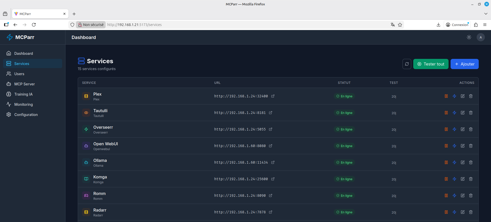
*Manage 15+ homelab services with health monitoring and connection testing*

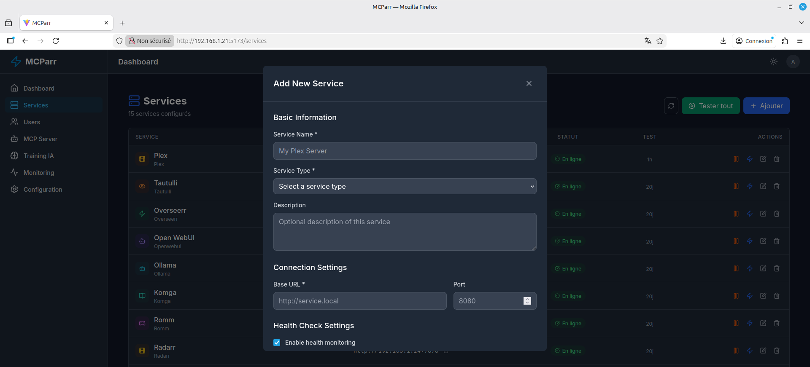
*Easy service configuration with automatic health checks*

</details>

<details>
<summary><b>User & Group Management</b></summary>

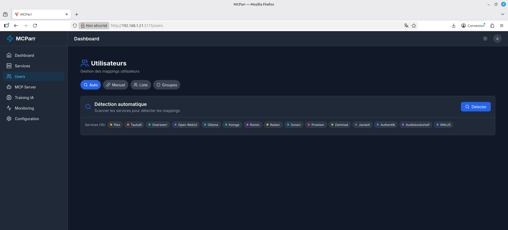
*Automatic user discovery across all services*

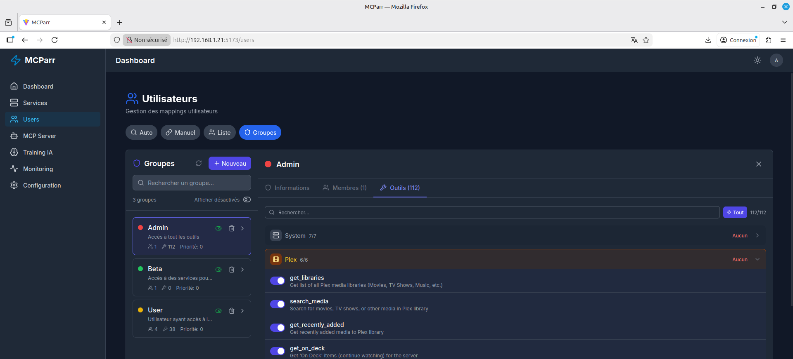
*Granular tool permissions per group (112 MCP tools available)*

</details>

<details>
<summary><b>AI Training with Ollama</b></summary>

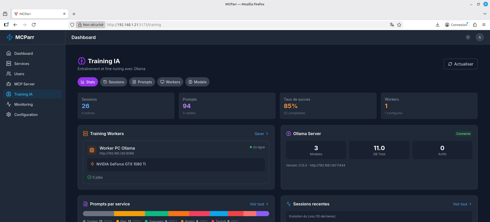
*Monitor training sessions with GPU support*

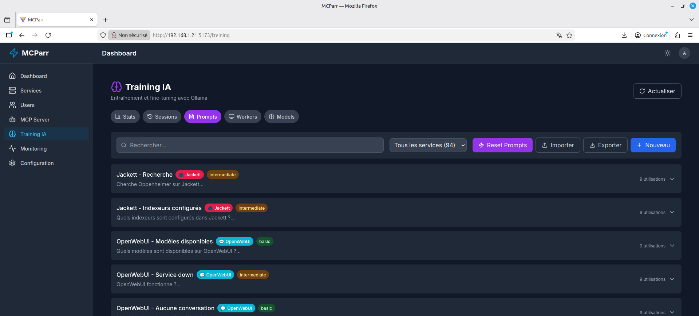
*94 validated prompts for fine-tuning models*

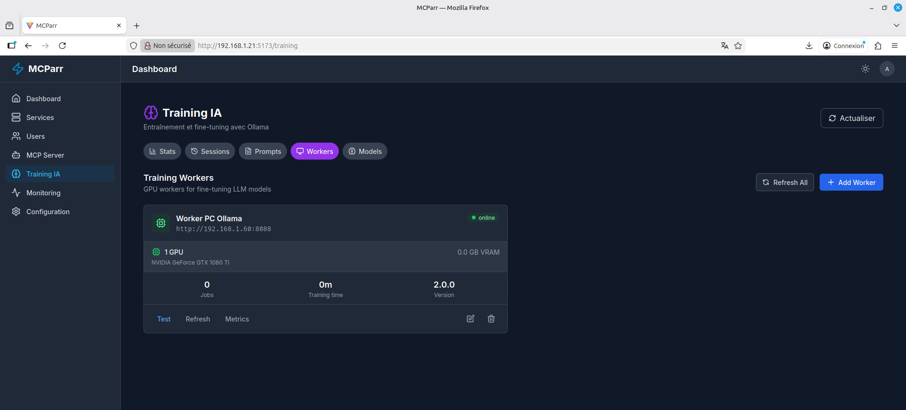
*GPU workers for distributed training*

</details>

<details>
<summary><b>Monitoring & Observability</b></summary>

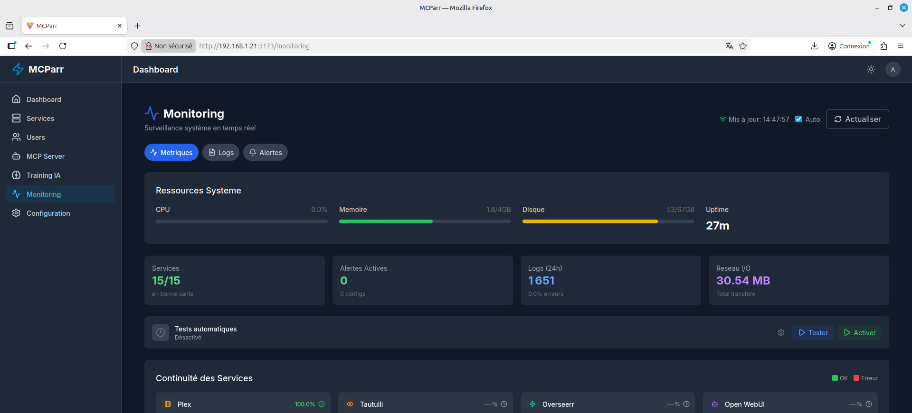
*Real-time system metrics with auto-refresh*

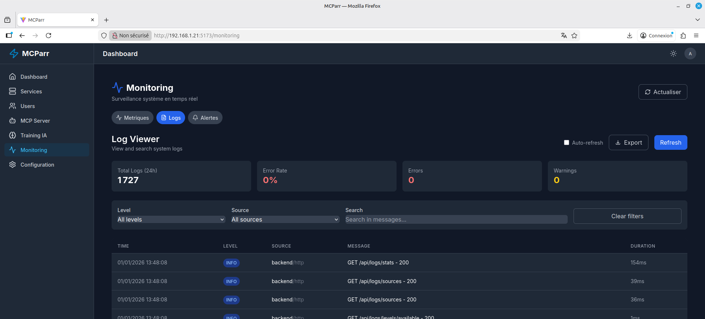
*Advanced log filtering and search (1700+ logs tracked)*

</details>

<details>
<summary><b>Configuration</b></summary>

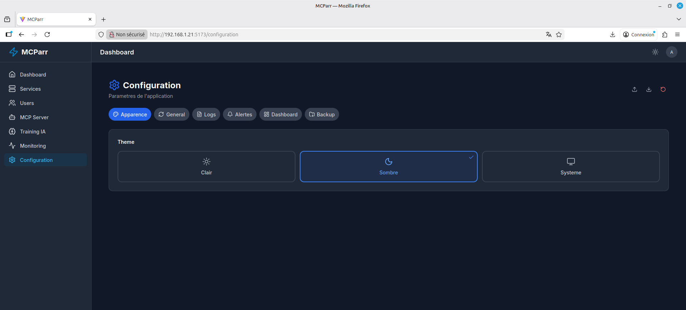
*Light/Dark/System theme options*

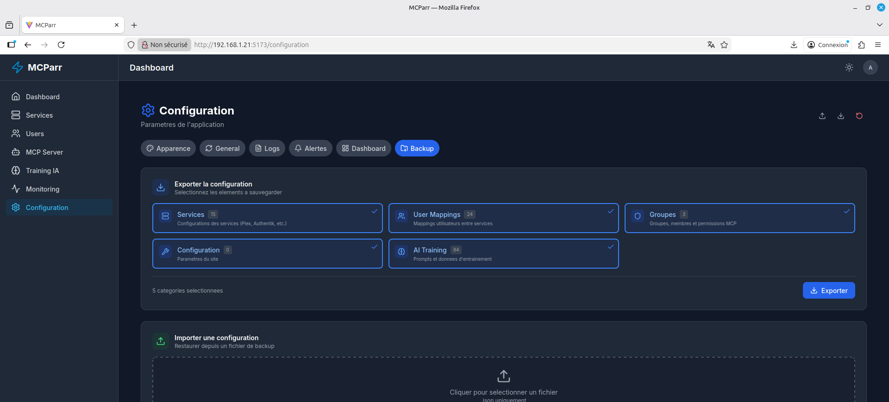
*Complete configuration backup with selective export*

</details>

## Contributing

Contributions are welcome! Please:

1. Fork the repository
2. Create a feature branch
3. Make your changes
4. Run tests and linting: `npm run lint && npm test`
5. Submit a pull request

## AI Tools Used

This project was built using AI-assisted development:

| Tool | Usage |
|------|-------|
| [Claude Code](https://claude.ai/claude-code) | 100% of codebase development (Anthropic's CLI) |
| [GitHub Spec-Kit](https://github.com/github/spec-kit) | Project planning and architecture design |

## License

MIT License - see [LICENSE](LICENSE) file for details

## Support

- [GitHub Repository](https://github.com/sharkhunterr/mcparr)
- [Documentation](docs/)
- [Issues](https://github.com/sharkhunterr/mcparr/issues)

---

**Built with** Claude Code **for the homelab community**
