# 👥 MCParr User Guide

Complete guide for using the MCParr AI Gateway web interface and connecting to Open WebUI.

## Table of Contents

- [Getting Started](#getting-started)
- [Dashboard](#dashboard)
- [Services Management](#services-management)
- [Service Groups](#service-groups)
- [User Management](#user-management)
- [MCP Server](#mcp-server)
- [Tool Chains](#tool-chains)
- [Global Search](#global-search)
- [AI Training](#ai-training)
- [Monitoring](#monitoring)
- [Alerts](#alerts)
- [Configuration](#configuration)
- [Open WebUI Integration](#open-webui-integration)
- [Help System](#help-system)

---

## Getting Started

After deploying MCParr, access the web interface at:
- **Web UI**: http://localhost:3000
- **API Docs**: http://localhost:8000/docs
- **MCP Server**: http://localhost:8001

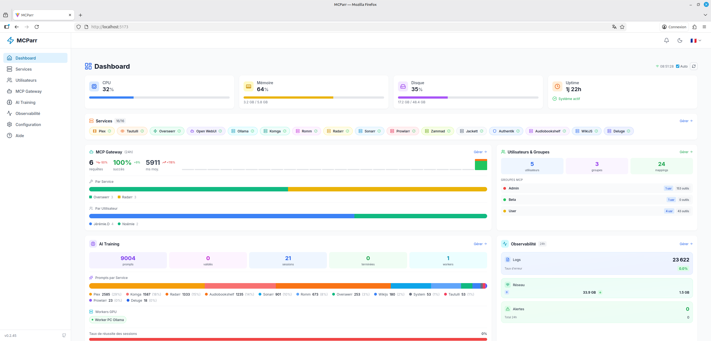

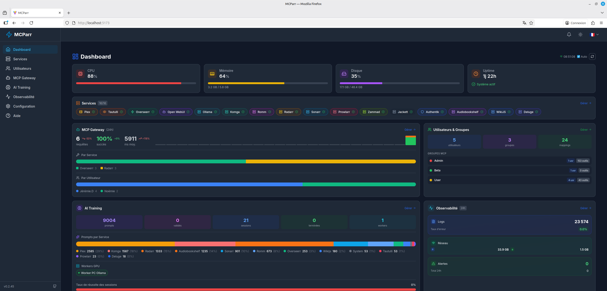

---

## Dashboard

The dashboard provides an overview of your MCParr instance with key metrics and quick access to all features.

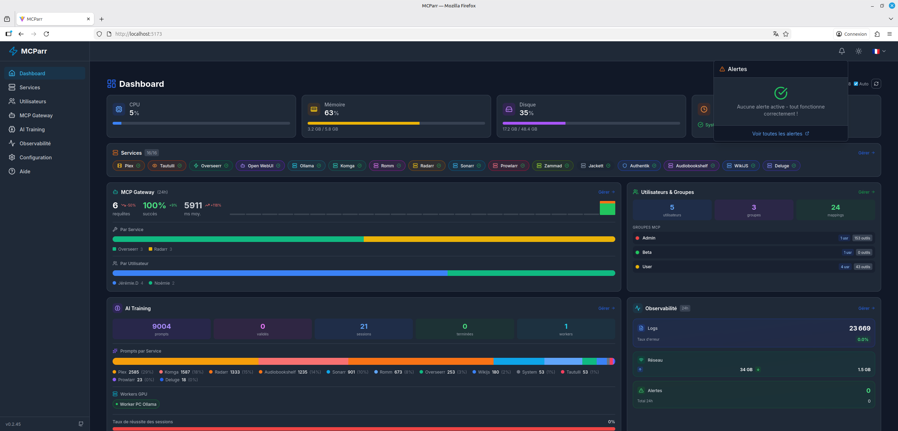

### System Resources
Monitor CPU, Memory, and Disk usage in real-time with color-coded progress bars:
- **Green**: Healthy (0-60%)
- **Yellow**: Warning (60-80%)
- **Red**: Critical (80-100%)

### Services Status
View the health of all 15+ configured services at a glance. Services shown include:
- Media: Plex, Tautulli, Overseerr
- Downloads: Radarr, Sonarr, Prowlarr, Jackett, Deluge
- Books: Komga, Audiobookshelf, ROMM
- Utilities: Authentik, Wiki.js, Zammad
- AI: Open WebUI, Ollama

### MCP Gateway Statistics
- **Total Requests**: MCP tool invocations in last 24h
- **Success Rate**: Percentage of successful tool calls
- **Average Duration**: Mean response time per request

### Users & Groups
Quick summary showing:
- Total users mapped across services
- Number of configured groups
- Total user-service mappings

---

## Services Management

### Viewing Services

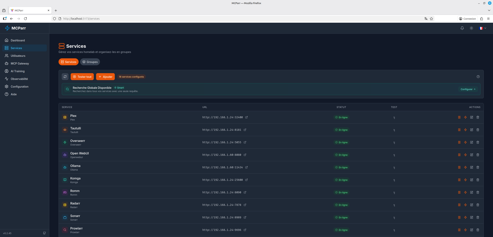

The Services page displays all configured homelab services with:
- **Service Icon & Name**: Visual identification
- **URL**: Base service URL
- **Status**: Online (En ligne) or Offline (Hors ligne)
- **Test Time**: When last tested (e.g., "20s" ago)
- **Actions**: 
  - 🔄 Refresh status
  - ⚡ Test connection
  - 🔧 Configure
  - ✏️ Edit
  - 🗑️ Delete

### Testing Service Connection

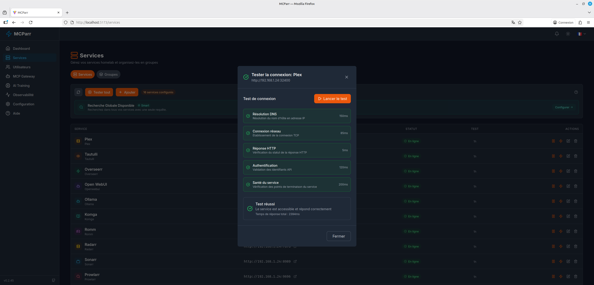

Click the test icon (⚡) to verify connectivity. The test performs 5 checks:

1. **DNS Resolution** - Resolving hostname to IP address
2. **Network Connection** - Establishing TCP connection
3. **HTTP Response** - Checking HTTP response status
4. **Authentication** - Validating API credentials
5. **Service Health** - Checking service-specific endpoints

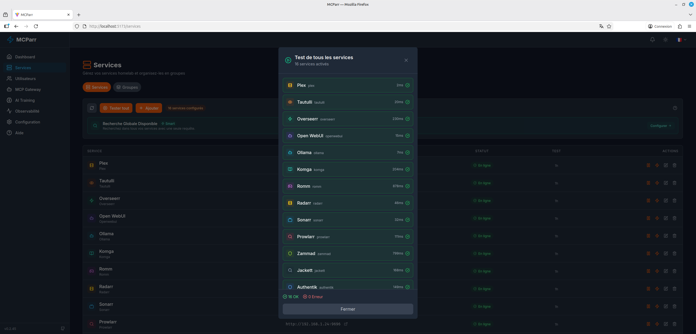

A successful test shows all checks passed with timing (e.g., "350ms", "94ms"). Click "Run Test" to retest or "Close" to dismiss.

### Editing a Service

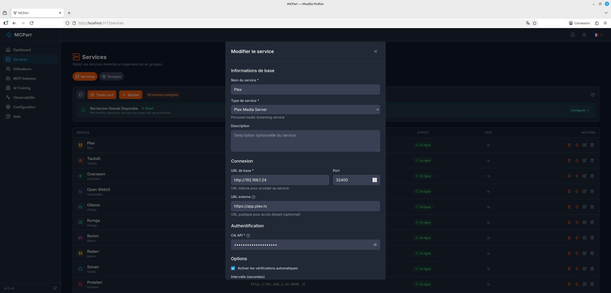

Edit existing services by clicking the edit button.

### Adding a New Service

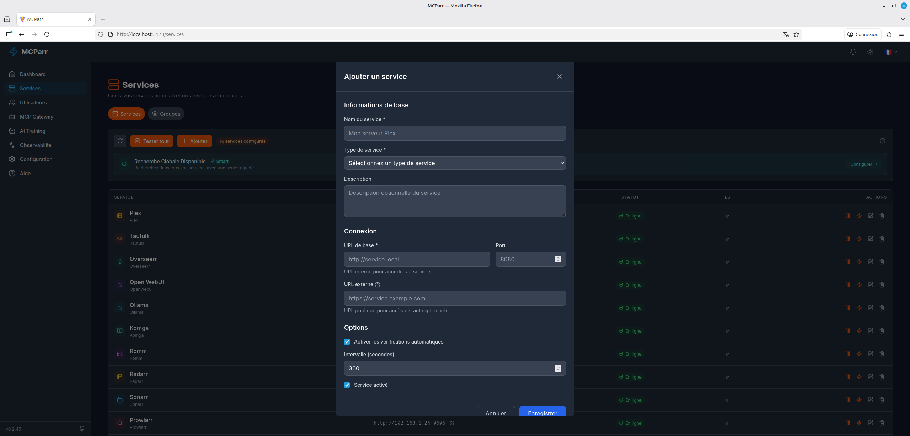

To add a service:

1. Click **"+ Ajouter"** (Add) button
2. Fill in the form:
   - **Service Name**: Descriptive name (e.g., "My Plex Server")
   - **Service Type**: Select from dropdown
   - **Description**: Optional description
   - **Base URL**: Service URL (e.g., `http://service.local`)
   - **Port**: Service port (e.g., `8080`)
3. **Health Check Settings**:
   - ✓ Enable health monitoring (recommended)
4. Click **Save**

**Supported Service Types:**
- Plex, Jellyfin, Emby
- Overseerr, Radarr, Sonarr, Prowlarr
- Tautulli, Deluge, qBittorrent, Jackett
- Komga, Audiobookshelf, ROMM
- Authentik, Wiki.js, Zammad
- Open WebUI, Ollama

---

## Service Groups

Service Groups allow you to organize services for easier management and Open WebUI auto-configuration.

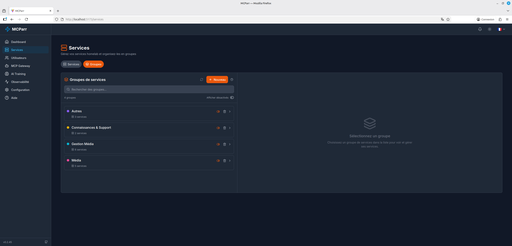

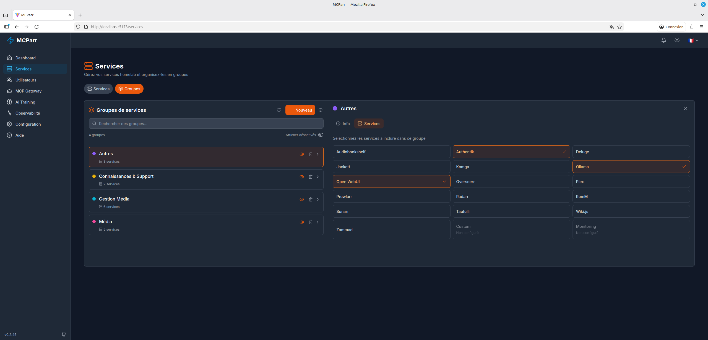

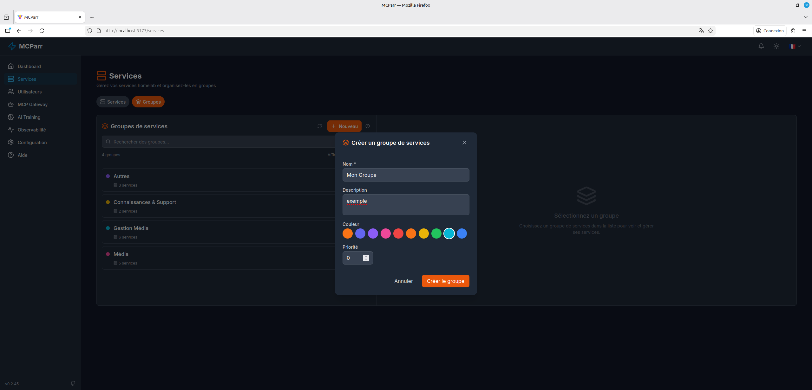

### Creating a Service Group

1. Go to **Services** → **Groups** tab
2. Click **+ New Group**
3. Fill in the form:
   - **Name**: Descriptive name (e.g., "Media Tools", "Download Managers")
   - **Description**: Optional description
   - **Color**: Select a color for visual identification
4. Select services to include in the group
5. Click **Save**

### Use Cases

- **Organize by function**: Media, Downloads, Books, Utilities
- **Organize by access level**: Admin Tools, User Tools, Guest Tools
- **Auto-configuration**: Create one Open WebUI endpoint per group

### Using Groups in Auto-Configuration

When auto-configuring Open WebUI with **Service Group** mode:
- One OpenAPI endpoint is created per service group
- Each endpoint contains only tools from services in that group
- Useful for giving different users access to different tool sets

---

## User Management

### Automatic User Detection

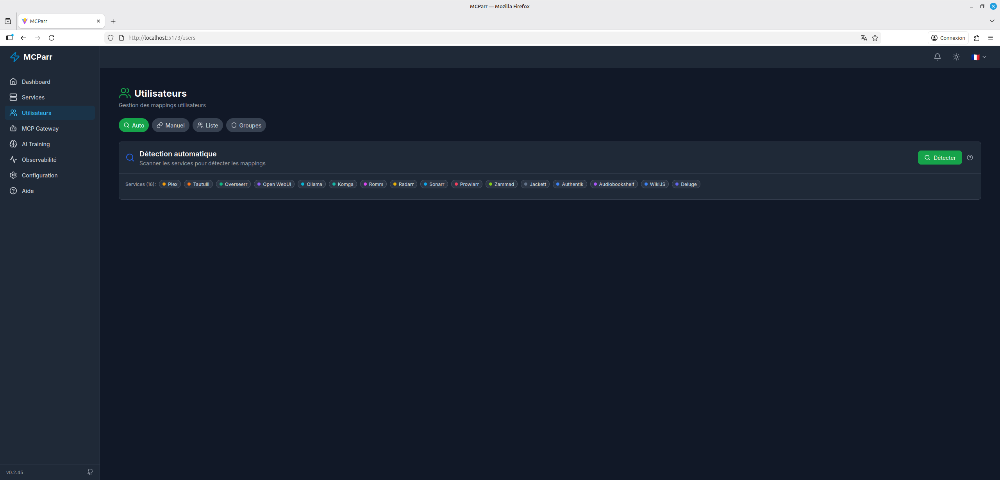

MCParr can automatically discover users across all your services:

1. Go to **Users** tab
2. Click **Auto** mode
3. Click **Détecter** (Detect) button
4. MCParr scans all 15 configured services
5. Found users are automatically mapped

**Services Scanned:**
The detection queries user lists from: Plex, Tautulli, Overseerr, Open WebUI, Ollama, Komga, Romm, Radarr, Sonarr, Prowlarr, Jackett, Deluge, Audiobookshelf, Wiki.js, Authentik, Zammad

### Managing User Groups

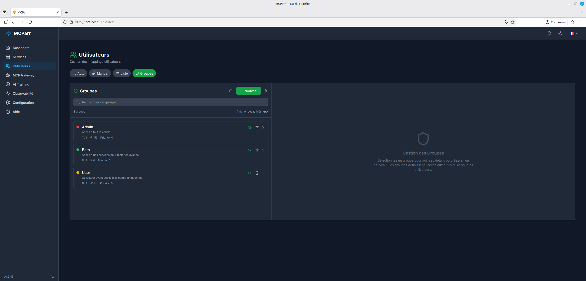

Groups organize users and control access to MCP tools.

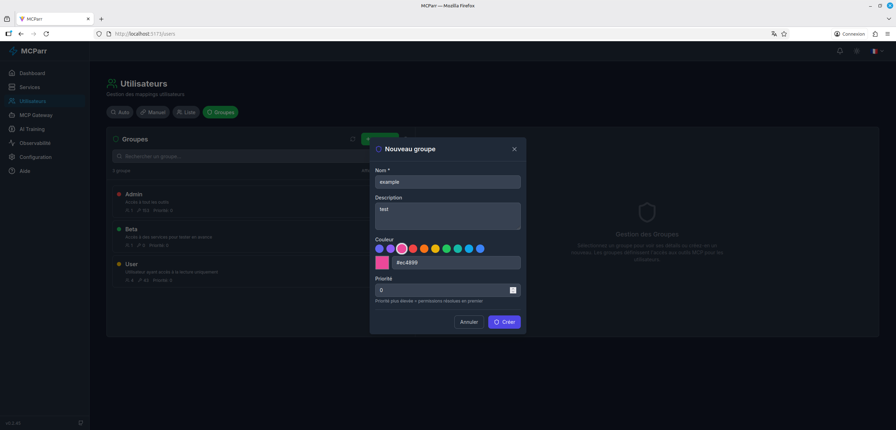

Create new user groups with custom settings.

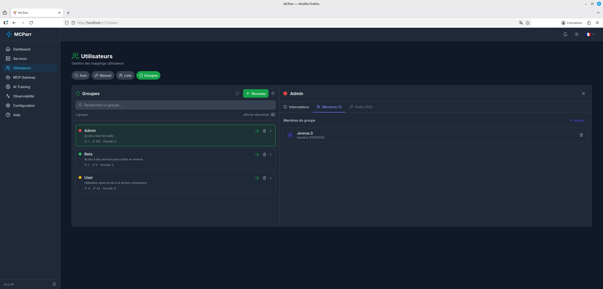

Add users to existing groups.

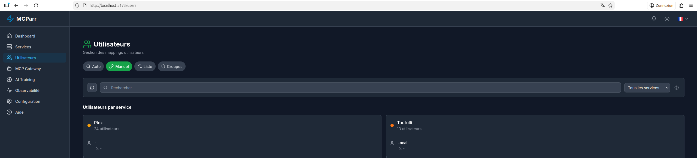

Manually manage user mappings.

**Default Groups:**
- **Admin** (red): Full access to all 112 tools
  - 1 user, 112 tools
  - Priority: 0 (highest)
- **Beta** (green): Limited access for testing
  - 1 user, 0 tools
  - Priority: 0
- **User** (yellow): Standard user access
  - 4 users, 38 tools
  - Priority: 0

**Group Actions:**
- ✓ Enable/disable group
- 📋 Copy group
- ➡️ View details
- ✏️ Edit group settings
- Click group to view members and tools

### Configuring Group Permissions

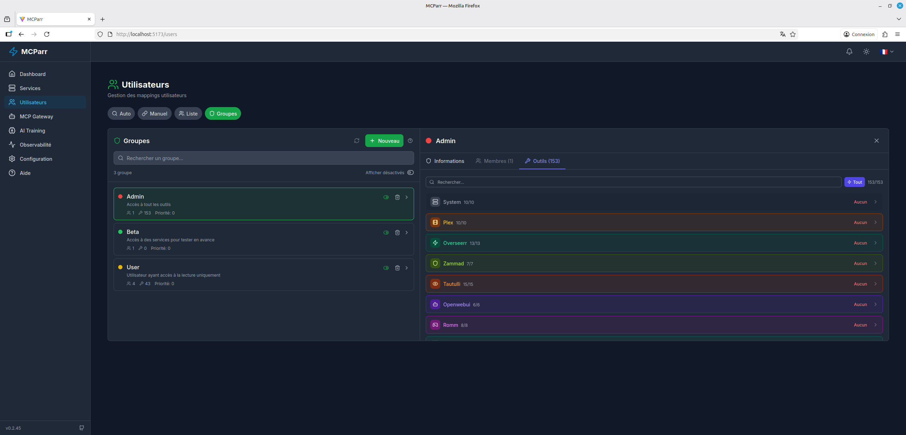

Fine-tune which MCP tools each group can access:

1. Select a group (Admin, Beta, User)
2. Go to **Outils (112)** tab
3. View tools organized by service:
   - **System** (7/7 tools)
   - **Plex** (6/6 tools): get_libraries, search_media, get_recently_added, get_on_deck, get_playback_info, get_library_stats
   - **Overseerr**, **Radarr**, **Sonarr**, **Prowlarr**, **Deluge**, **Jackett**, **Komga**, **Audiobookshelf**, **ROMM**, **Wiki.js**, **Zammad**, **Authentik**, **OpenWebUI**, **Ollama**
4. **Toggle** tools on/off for the group
5. Click **Sauvegarder** (Save)

**Permissions Strategy:**
- Admin: All tools (*)
- Power Users: Media + Downloads + Monitoring
- Standard Users: Media search and requests only
- Guests: Read-only tools

**Search & Filter:**
- Use search bar: "Rechercher..." to find specific tools
- Click **+ Tout** to enable all tools
- Shows count: "112/112" (enabled/total)

---

## MCP Server

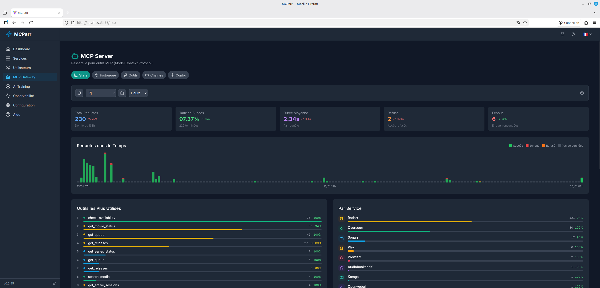

Monitor Model Context Protocol server activity and tool usage.

### MCP History

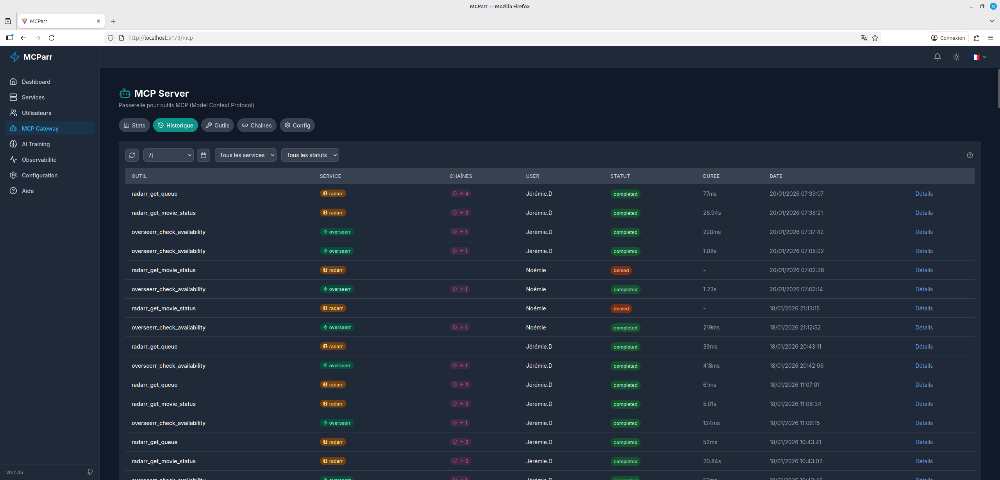

View the complete history of all MCP tool calls with filtering options.

### MCP Tools

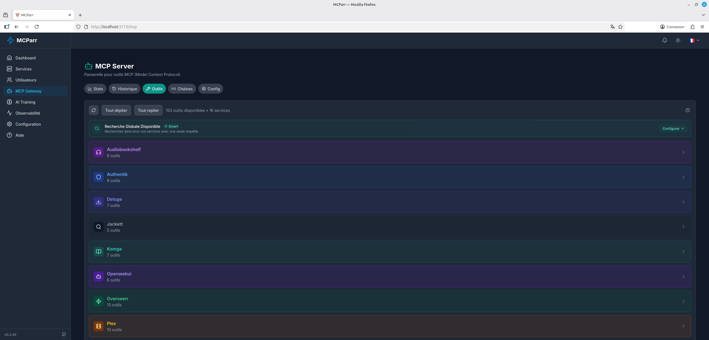

Browse all available MCP tools grouped by service.

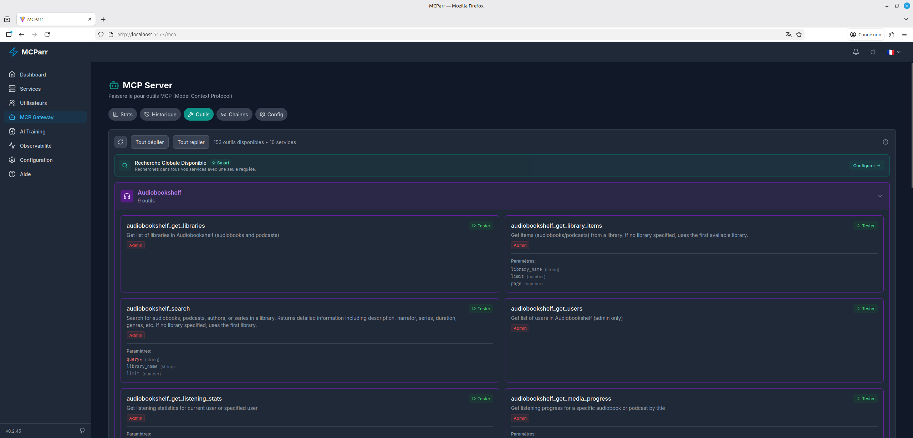

View tools without grouping for a flat list.


Test any MCP tool directly from the interface with custom parameters.

### MCP Configuration

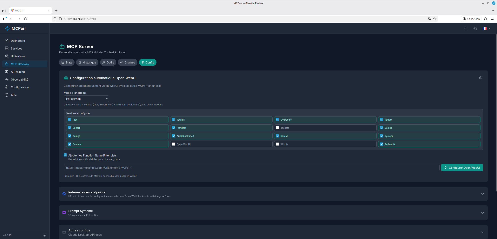

Configure MCP server settings and tool access.

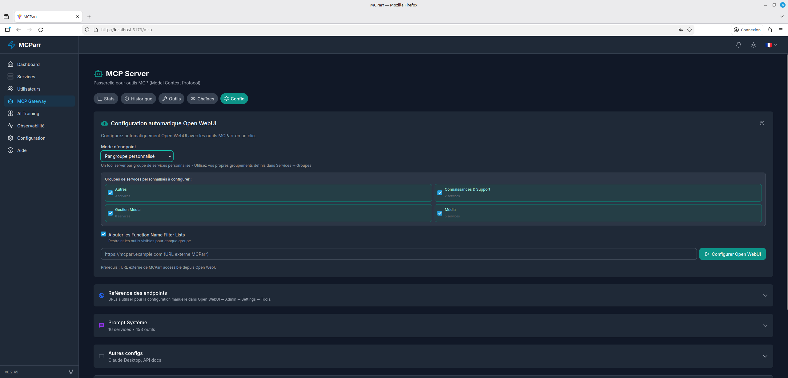

Configure tool permissions per user group.

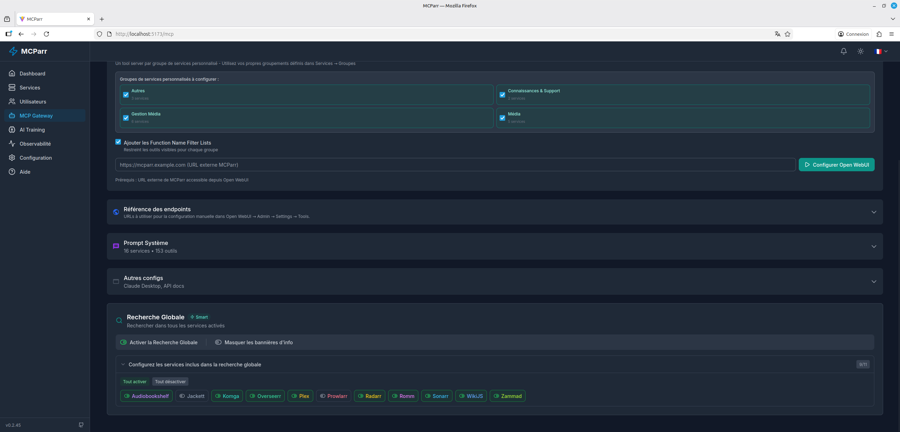

Enable/disable services for global search functionality.

### Statistics (24h)
- **Total Requests**: 0 (in last 24h)
- **Success Rate**: 100%
- **Average Duration**: - (per request timing)
- **Failed**: 0 errors encountered

### Requests Over Time
Graph visualization showing:
- 🟢 **Success**: Successful tool calls
- 🔴 **Failed**: Failed tool calls
- ⚪ **No data**: Time periods with no activity

X-axis: Time (15:00 → 03:00 → 14:00)
Y-axis: Request count

### Top Tools
Most frequently used MCP tools (empty when no usage data).

### Par Service (By Service)
Usage breakdown showing which services are being accessed via MCP tools (empty when no usage data).

**Use Cases:**
- Monitor AI assistant activity
- Identify most popular tools
- Detect unusual patterns
- Optimize tool performance

---

## Tool Chains

Tool Chains allow you to create automated workflows with conditional logic (IF/THEN/ELSE).

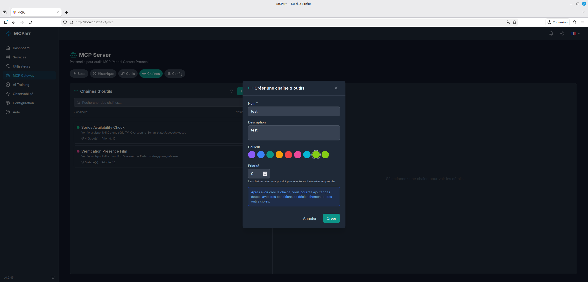

### Creating a Tool Chain

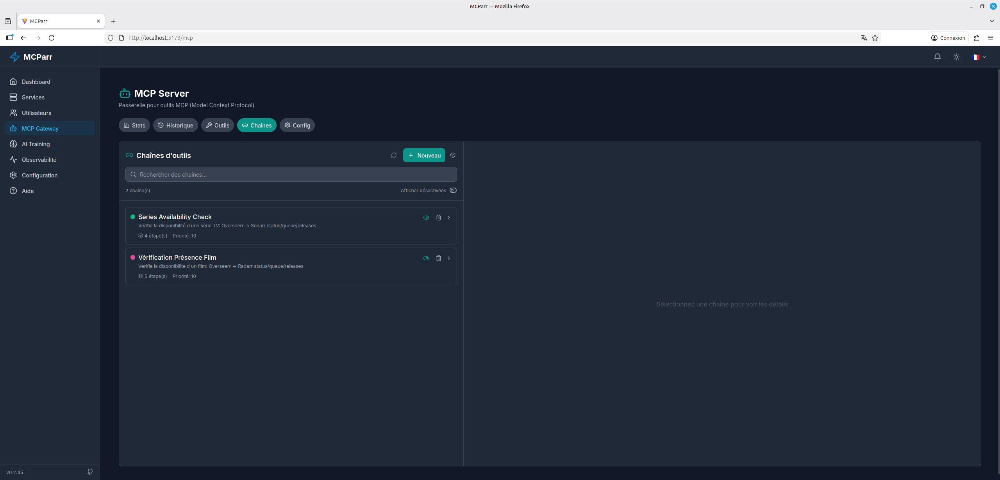

1. Go to **MCP** → **Chains** tab
2. Click **+ New Chain**
3. Configure the chain:
   - **Name**: Descriptive name
   - **Description**: What this chain does
   - **Trigger Tool**: The tool that starts the chain
4. Add chain steps with conditions and actions

### Chain Step Configuration

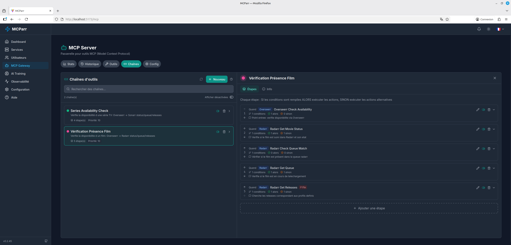

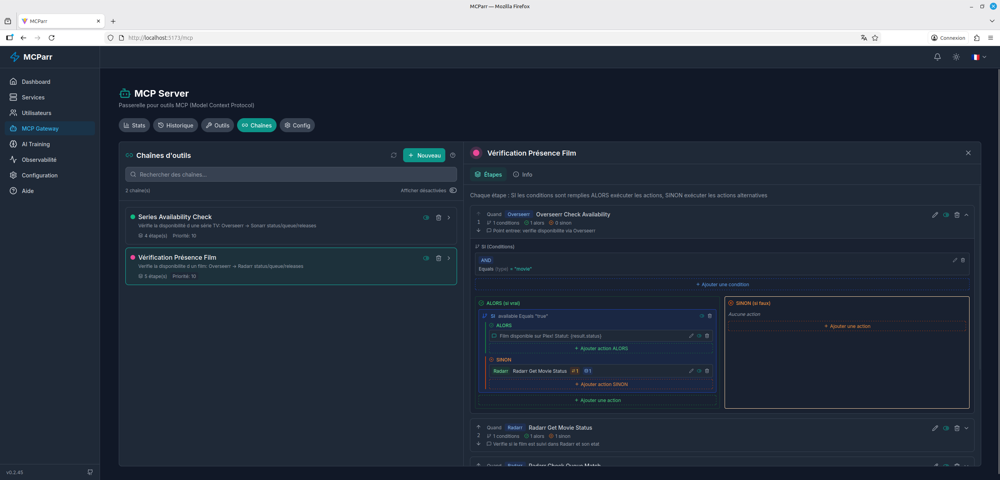

Each step includes:
- **Source Tool**: Tool to execute
- **Condition**: IF logic to evaluate
- **THEN Action**: Tool to execute if condition is true
- **ELSE Action**: Tool to execute if condition is false

### Condition Operators

| Operator | Description | Example |
|----------|-------------|---------|
| `eq` | Equals | `result.count eq 0` |
| `ne` | Not equals | `result.status ne "error"` |
| `contains` | String contains | `result.title contains "Star"` |
| `is_empty` | Field is empty/null | `result.items is_empty` |
| `is_not_empty` | Field has value | `result.data is_not_empty` |
| `success` | Tool succeeded | `success` |
| `failed` | Tool failed | `failed` |
| `regex` | Regex match | `result.name regex "^test.*"` |

### Context Variables

Pass data between chain steps using context:

```json
{
  "save_to_context": {
    "movie_id": "result.tmdbId"
  }
}
```

Use in subsequent steps:
```json
{
  "argument_mappings": {
    "mediaId": "{context.movie_id}"
  }
}
```

### Example: Smart Media Request

```
Chain: Request if not in library
├── Step 1: plex_search(query)
│   └── Condition: result.items is_empty
│       ├── THEN: overseerr_search_media(query)
│       │   └── save_to_context: tmdb_id
│       └── ELSE: return "Already in library"
├── Step 2: overseerr_request_movie({context.tmdb_id})
└── Return: "Movie requested successfully"
```

---

## Global Search

Global Search allows you to search across all enabled services simultaneously using the `system_global_search` MCP tool.

### Configuration

1. Go to **MCP** → **Configuration** tab
2. Find the **Global Search** section
3. Toggle services on/off for inclusion in global search
4. Set priority order (determines result ordering)

### Searchable Services

| Category | Services | Content Type |
|----------|----------|--------------|
| **Media** | Overseerr, Radarr, Sonarr, Plex | Movies, TV shows |
| **Indexers** | Jackett, Prowlarr | Torrent results |
| **Books** | Komga, Audiobookshelf | Comics, audiobooks |
| **Wiki** | Wiki.js | Wiki pages |
| **Support** | Zammad | Support tickets |

### Using Global Search

In Open WebUI or via MCP:
```
User: Search for "Inception" everywhere
AI: [Uses system_global_search tool]
    Found results across 4 services:

    📺 Plex: "Inception" (2010) - In library
    🎬 Overseerr: Available to request
    🔍 Jackett: 15 torrent results
    📚 Wiki.js: 2 wiki pages about Inception
```

---

## AI Training

> ⚠️ **Note**: This feature is currently under development and not fully functional. The documentation below describes the planned functionality.

### Training Overview


The Training IA page manages Ollama model fine-tuning with GPU support.

**Key Metrics:**
- **Sessions**: 26 total (0 active)
- **Prompts**: 94 validated
- **Taux de succès** (Success Rate): 85% (22 completed)
- **Workers**: 1 configured

**Training Workers Panel:**
- **Worker PC Ollama**: http://192.168.1.60:8088
- GPU: NVIDIA GeForce GTX 1080 Ti
- Status: 🟢 En ligne (Online)
- Jobs: 0 jobs running

**Ollama Server Panel:**
- **3 Modèles** (Models): Total models available
- **11.0 GB total**: Storage used
- **0 Actifs**: Currently running models
- Version: 0.13.0 - http://192.168.1.60:11434
- **Connecte** button: Test connection

**Prompts par service** (Prompts by Service):
Horizontal bar chart showing distribution across:
- System: 12 prompts
- Plex: 12 prompts
- Overseerr: 9 prompts
- Radarr: 8 prompts
- Sonarr: 8 prompts
- Tautulli: 8 prompts
- Prowlarr: 7 prompts

**Sessions récentes** (Recent Sessions):
Graph showing "Evolution du Loss (10 dernières)"  - training loss over last 10 sessions.

### Managing Training Sessions

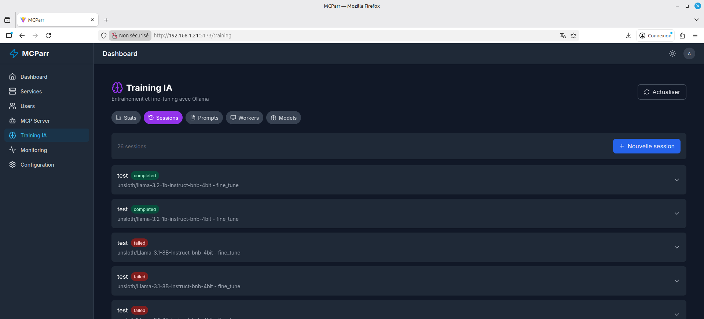

View all training sessions with status indicators:

- **test** - ✅ completed
  - Model: unsloth/llama-3.2-1b-instruct-bnb-4bit → fine_tune
  - Status: Green "completed" badge
  - Expandable for details (click ▼)

- **test** - ❌ failed
  - Model: unsloth/Llama-3.1-8B-Instruct-bnb-4bit → fine_tune
  - Status: Red "failed" badge

**Actions:**
- Click **+ Nouvelle session** to create new training session
- Expand session to view:
  - Training parameters
  - Loss curves
  - Model outputs
  - Error logs (if failed)

### Creating a Training Session

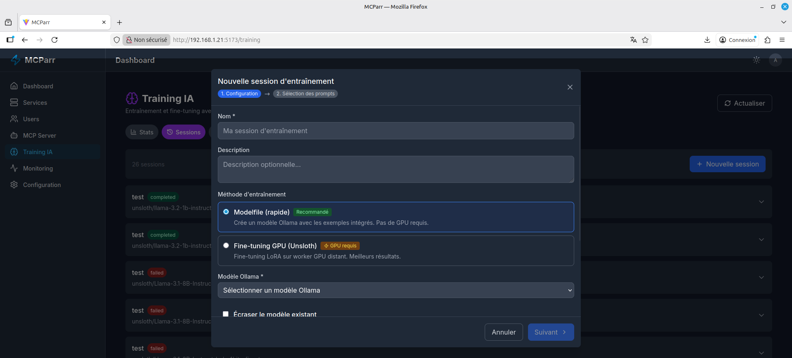

Two-step wizard for creating training sessions:

**Step 1: Configuration**

1. **Nom** (Name): Session identifier (e.g., "Ma session d'entraînement")
2. **Description**: Optional description
3. **Méthode d'entraînement** (Training Method):
   - **Modelfile (rapide)** ⭐ Recommandé:
     - Create Ollama model from examples
     - No GPU required
     - Fast model creation from integrated examples
   - **Fine-tuning GPU (Unsloth)** ⚠️ GPU requis:
     - Fine-tune LoRA on remote GPU worker
     - Better results
4. **Modèle Ollama**: Select base model from dropdown
5. **Écraser le modèle existant** (Overwrite existing model): Checkbox option

Click **Suivant** (Next) to proceed to Step 2: Prompt selection.

**Step 2: Sélection des prompts** (not shown in screenshot, see next section)

### Managing Training Prompts


Browse, filter, and manage prompts for training.

**Filter Options:**
- **Search bar**: "Rechercher..." to find prompts
- **Service filter**: Tous les services (94) dropdown
  - Filter by: Jackett, OpenWebUI, Overseerr, Radarr, Sonarr, Prowlarr, etc.
- **Reset Prompts**: Clear and reimport all prompts
- **Import/Export**: Backup and restore prompts
- **+ Nouveau**: Create new prompt

**Prompt List:**
Each prompt shows:
- **Title**: e.g., "Jackett - Recherche"
- **Tags**: 
  - Service badge (red "Jackett")
  - Difficulty (orange "intermediate")
- **Description**: "Cherche Oppenheimer sur Jackett..."
- **Usage count**: "9 utilisations" (9 uses)
- **Actions**: Expand (▼) for details

**Example Prompts:**
- Jackett - Recherche (intermediate, 9 uses)
- Jackett - Indexeurs configurés (intermediate, 9 uses)
- OpenWebUI - Modèles disponibles (basic, 9 uses)
- OpenWebUI - Service down (intermediate, 9 uses)
- OpenWebUI - Aucune conversation (basic, 9 uses)

### Creating Custom Prompts

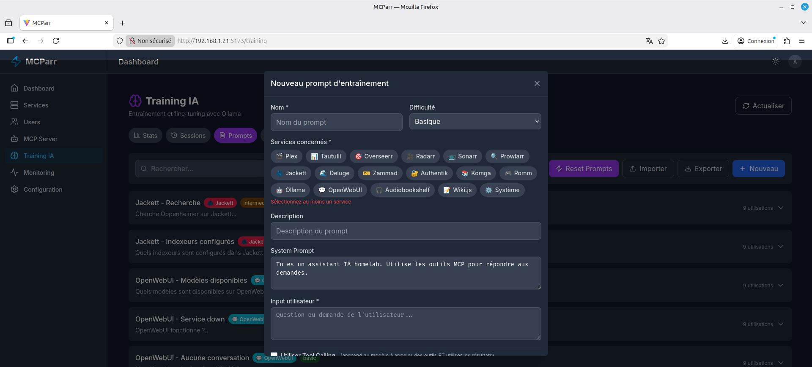

Create custom training prompts for fine-tuning:

**Form Fields:**
1. **Nom du prompt**: Name your prompt
2. **Difficulté** (Difficulty): Select difficulty level
   - Basique (Basic)
   - Intermediate  
   - Advanced
3. **Services concernés** (Related Services): Multi-select
   - Options: Plex, Tautulli, Overseerr, Radarr, Sonarr, Prowlarr, Jackett, Deluge, Audiobookshelf, Komga, Romm, Ollama, OpenWebUI, WikiJS, Système
4. **Description**: Describe the prompt purpose
5. **System Prompt**: System instructions for AI
   - Example: "Tu es un assistant IA homelab, utilise les outils MCP pour répondre aux demandes."
6. **Input utilisateur** (User Input): User question/request
   - Example: "Question ou demande de l'utilisateur..."

**Actions:**
- **Annuler** (Cancel): Discard changes
- **Suivant** (Next): Proceed to next step

### Managing Training Workers


Manage GPU workers for distributed fine-tuning.

**Worker Card:**
- **Worker PC Ollama**
  - 🖥️ URL: http://192.168.1.60:8088
  - 🎮 GPU: NVIDIA GeForce GTX 1080 Ti
  - Status: 🟢 En ligne (Online)
  - **0** Jobs: No active training jobs
  - **0m** Training time: 0 minutes total

**Actions:**
- **Test**: Verify worker connectivity
- **Refresh**: Update worker status
- **Metrics**: View performance metrics
- **Edit** (✏️): Modify worker configuration
- **Delete** (🗑️): Remove worker

**Add Worker:**
Click **+ Add Worker** button to configure new GPU workers.

**Worker Requirements:**
- GPU with CUDA support
- Python 3.10+
- Unsloth library installed
- Network accessible from MCParr host
- Port 8088 open

### Viewing Trained Models

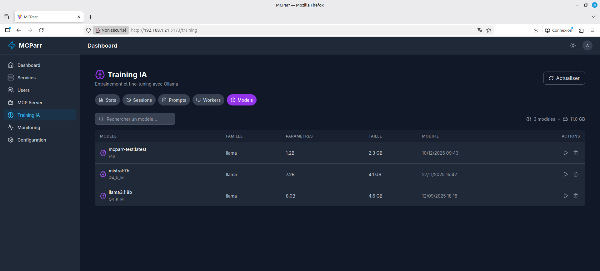

List all fine-tuned Ollama models created by MCParr.

**Model List:**
- **mcparr-test:latest** (F16)
  - Famille (Family): llama
  - Paramètres (Parameters): 1.2B
  - Taille (Size): 2.3 GB
  - Modifié (Modified): 10/12/2025 09:43

- **mistral:7b** (Q4_K_M)
  - Famille: llama
  - Paramètres: 7.2B
  - Taille: 4.1 GB
  - Modifié: 27/11/2025 15:42

- **llama3.1:8b** (Q4_K_M)
  - Famille: llama
  - Paramètres: 8.0B
  - Taille: 4.6 GB
  - Modifié: 12/09/2025 18:18

**Model Actions:**
- **▶️ Play** (Test): Test model with sample prompts
- **🗑️ Delete**: Remove model from Ollama

**Search & Filter:**
- Search bar: "Rechercher un modèle..."
- Total: **3 modèles • 📦 11.0 GB**

---

## Monitoring

### System Metrics

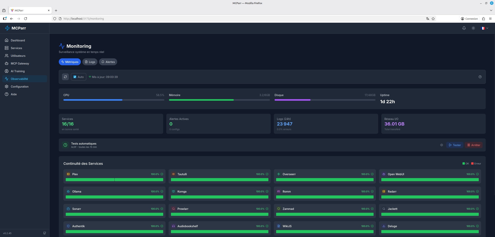

Real-time system monitoring with auto-refresh.

**Ressources Système** (System Resources):
- **CPU**: 0.0% usage (green progress bar)
- **Mémoire** (Memory): 1.8/4GB used (53%, green bar)
- **Disque** (Disk): 53/67GB used (79%, yellow bar)
- **Uptime**: 27m

**Quick Stats:**
- **Services**: 15/15 en bonne santé (15/15 healthy)
- **Alertes Actives** (Active Alerts): 0 configs
- **Logs (24h)**: 1651 logs, 0.0% erreurs (0.0% errors)
- **Réseau I/O** (Network I/O): 30.54 MB total transferts

**Tests automatiques** (Automated Tests):
- Status: Désactivé (Disabled)
- **Tester** button: Run tests manually
- **Activer** button: Enable automated testing

**Continuité des Services** (Service Continuity):
Horizontal status bars showing:
- Plex: 100.0% (green)
- Tautulli: ---%
- Overseerr: ---%
- Open WebUI: ---%
- All showing "OK" status

**Time Controls:**
- **Mis à jour**: 14:47:57 (Last updated)
- **Auto**: Auto-refresh toggle ✓
- **Actualiser** (Refresh): Manual refresh button

### Log Viewer

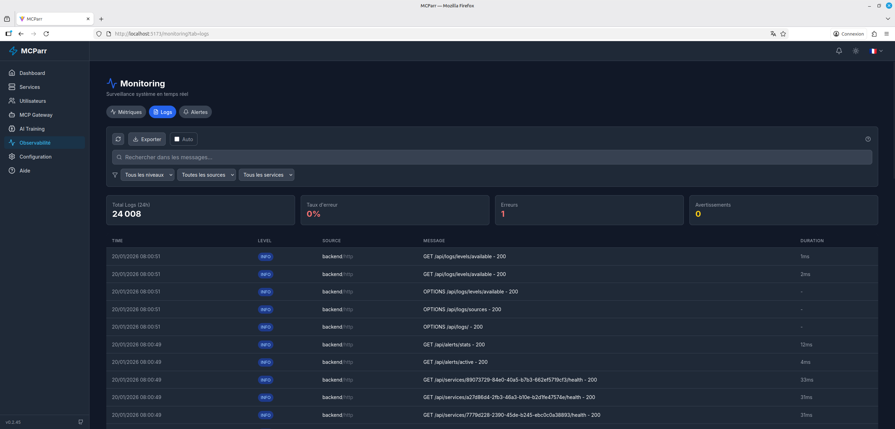

Advanced log filtering and real-time streaming.

**Statistics:**
- **Total Logs (24h)**: 1727
- **Error Rate**: 0%
- **Errors**: 0
- **Warnings**: 0

**Filter Controls:**
- **Level**: Dropdown filter
  - All levels (selected)
  - Info, Warning, Error, Critical
- **Source**: Dropdown filter
  - All sources (selected)
  - backend, http, frontend
- **Search**: Text search in messages

**Log Table Columns:**
- **TIME**: Timestamp (01/01/2026 13:48:08)
- **LEVEL**: Log level badge (INFO in blue)
- **SOURCE**: Origin (backend, http)
- **MESSAGE**: Log content
  - Examples: "GET /api/logs/stats - 200", "GET /api/logs/sources - 200"
- **DURATION**: Request duration (154ms, 39ms, 36ms)

**Controls:**
- **Clear filters**: Reset all filters
- **Auto-refresh**: Real-time log streaming ✓
- **Export**: Download logs to file
- **Refresh**: Manual refresh

**Use Cases:**
- Debug API requests
- Monitor HTTP errors
- Track slow endpoints
- Audit system activity

### Alert Management

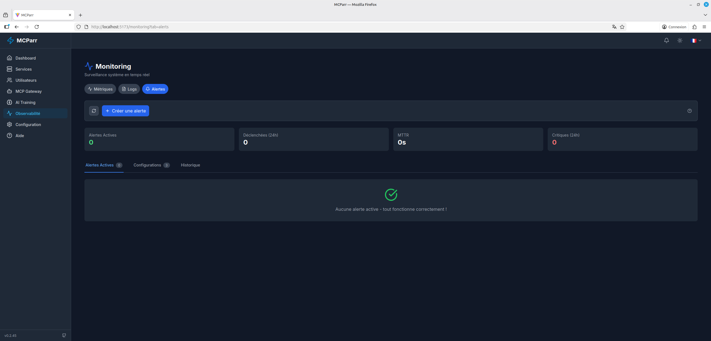

Configure and monitor system alerts.

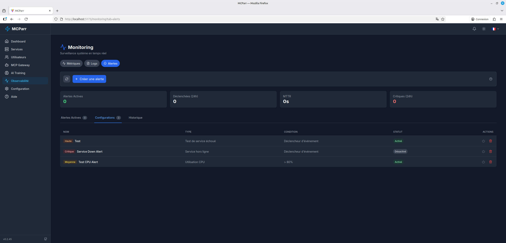

View currently active alerts.

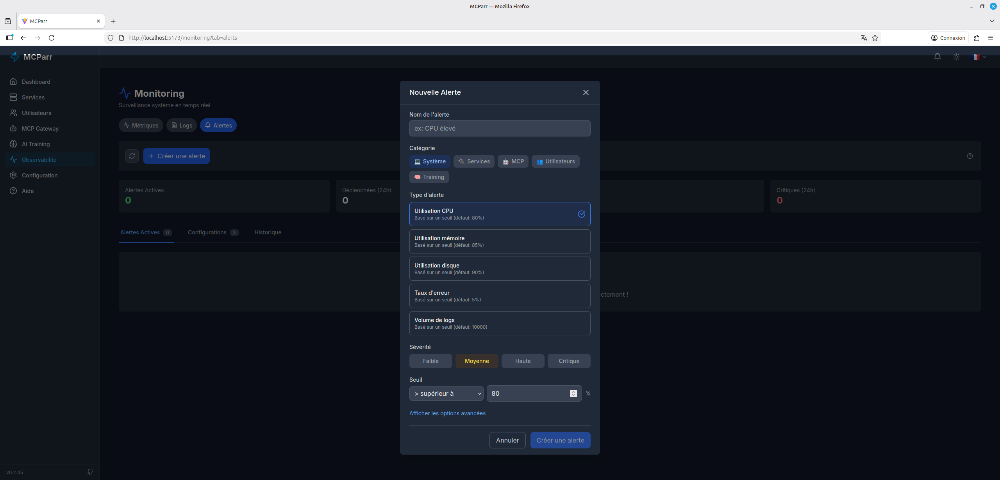

Create new alert rules.

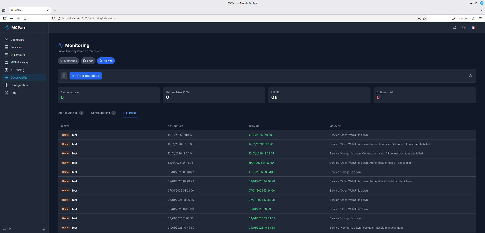

View alert history.

**Alert Statistics:**
- **Active Alerts**: 0
- **Triggered (24h)**: 0
- **MTTR**: 0s (Mean Time To Resolution)
- **Critical (24h)**: 0

**Tabs:**
- **Active Alerts** (selected)
- **Configurations** (0)
- **History**

**Current Status:**
- 🟢 Large green checkmark icon
- **"No active alerts - everything is running smoothly!"**

**Actions:**
- **Create Alert** button: Configure new alert rules

**Alert Types You Can Create:**
- Service down alerts
- High CPU/Memory/Disk usage
- Error rate threshold exceeded
- MCP request failures
- Training job failures

---

## Alerts

### Creating Alert Rules

1. Go to **Monitoring** → **Alerts** tab
2. Click **Configurations** tab
3. Click **+ Create Alert**
4. Configure the alert:
   - **Name**: Descriptive name
   - **Metric Type**: What to monitor
   - **Threshold**: Value and operator
   - **Severity**: low, medium, high, critical
   - **Cooldown**: Minutes between re-triggers
   - **Service** (optional): Specific service to monitor

### Metric Types

| Metric | Description | Example Threshold |
|--------|-------------|-------------------|
| `cpu` | CPU usage percentage | > 80% |
| `memory` | Memory usage percentage | > 85% |
| `disk` | Disk usage percentage | > 90% |
| `service_test_failed` | Service health check failure | = 1 |
| `service_down` | Service unreachable | = 1 |

### Alert States

- **Normal**: Metric within threshold
- **Firing**: Threshold exceeded, alert triggered
- **Resolved**: Was firing, now back to normal

### Notifications

Configure notification channels in **Configuration** → **Alerts**:

**Email Notifications:**
- SMTP server settings
- From/To addresses
- Subject template

**Webhook Notifications:**
- URL endpoint (e.g., Slack, Discord)
- Custom payload template

### Alert History

View all triggered alerts in the **History** tab:
- When triggered and resolved
- Duration of alert
- Metric values at trigger time

---

## Configuration

### Appearance

Customize the interface theme.

**Theme Options:**
- ☀️ **Clair** (Light): Light theme with white background
- 🌙 **Sombre** (Dark): Dark theme (selected, with blue border)
- 💻 **Système** (System): Follow OS preference

Click any theme card to apply immediately.

### General Settings

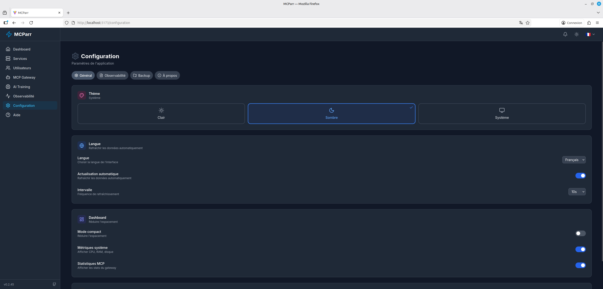

Application-wide settings.

**Actualisation automatique** (Auto-refresh):
- Toggle: ✓ Enabled (blue)
- Description: "Rafraîchir les données automatiquement" (Refresh data automatically)

**Intervalle** (Interval):
- Dropdown: **10s** (selected)
- Description: "Fréquence de rafraîchissement" (Refresh frequency)
- Options: 10s, 30s, 1min, 5min

### Logs Configuration

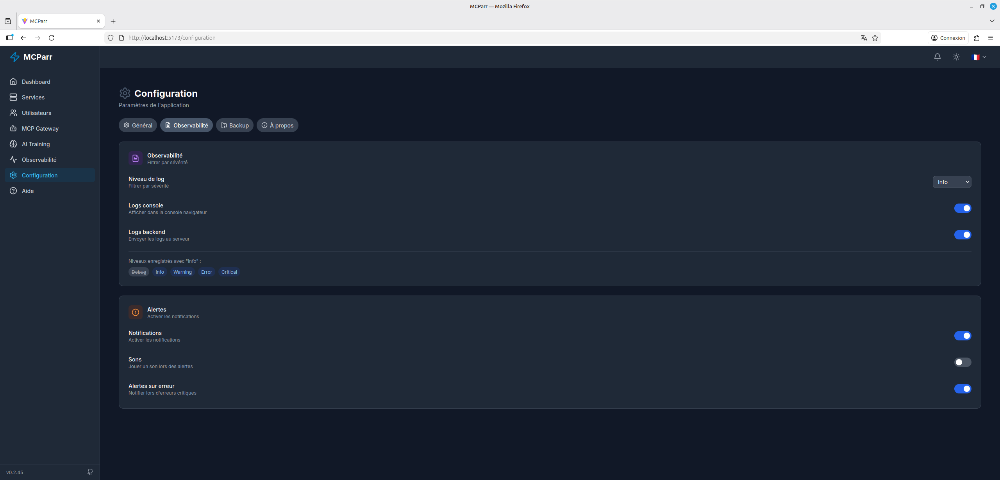

Configure logging behavior.

**Niveau de log** (Log Level):
- Dropdown: **Info** (selected)
- Description: "Filtrer par sévérité" (Filter by severity)
- Options: Debug, Info, Warning, Error, Critical

**Logs console** (Console Logs):
- Toggle: ✓ Enabled (blue)
- Description: "Afficher dans la console navigateur" (Display in browser console)

**Logs backend** (Backend Logs):
- Toggle: ✓ Enabled (blue)
- Description: "Envoyer les logs au serveur" (Send logs to server)

**Niveaux enregistrés avec "info"** (Levels recorded with "info"):
Badges showing: Debug, Info, Warning, Error, Critical

### Alerts Configuration

Configure alert notifications.

**Notifications**:
- Toggle: ✓ Enabled (blue)
- Description: "Activer les notifications" (Enable notifications)

**Sons** (Sounds):
- Toggle: ✗ Disabled (gray)
- Description: "Jouer un son lors des alertes" (Play sound on alerts)

**Alertes sur erreur** (Error Alerts):
- Toggle: ✓ Enabled (blue)
- Description: "Notifier lors d'erreurs critiques" (Notify on critical errors)

### Dashboard Configuration

Customize dashboard widgets.

**Mode compact** (Compact Mode):
- Toggle: ✗ Disabled (gray)
- Description: "Réduire l'espacement" (Reduce spacing)

**Métriques système** (System Metrics):
- Toggle: ✓ Enabled (blue)
- Description: "Afficher CPU, RAM, disque" (Show CPU, RAM, Disk)

**Statistiques MCP** (MCP Statistics):
- Toggle: ✓ Enabled (blue)
- Description: "Afficher les stats du gateway" (Show gateway stats)

### About

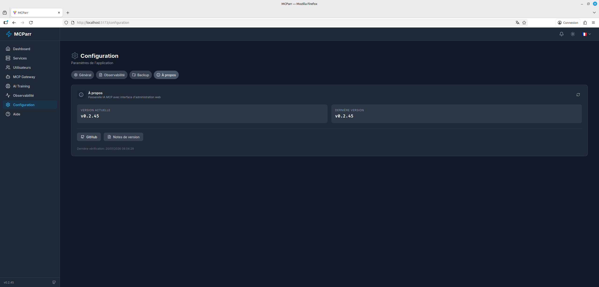

View application version and information.

### Backup & Restore

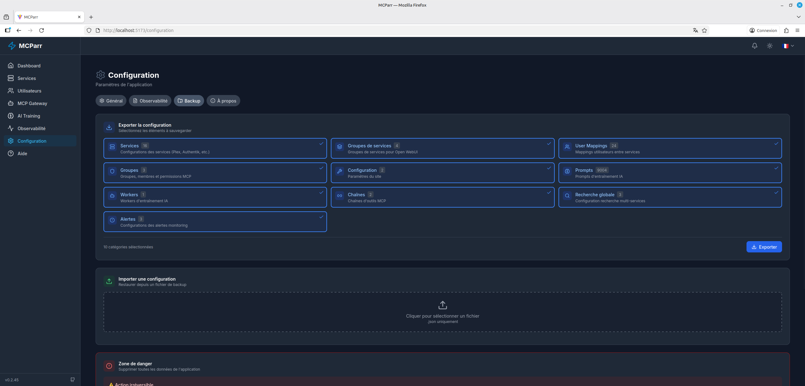

Export and import complete configuration.

**Exporter la configuration** (Export Configuration):
- Description: "Sélectionnez les éléments à sauvegarder" (Select elements to backup)
- ✓ **Services** (15): Configurations des services (Plex, Authentik, etc.)
- ✓ **User Mappings** (24): Mappings utilisateurs entre services
- ✓ **Groupes** (3): Groupes, membres et permissions MCP
- ✓ **Configuration** (0): Paramètres du site
- ✓ **AI Training** (94): Prompts et données d'entraînement
- **5 catégories sélectionnées** (5 categories selected)
- **Exporter** button: Download JSON backup

**Importer une configuration** (Import Configuration):
- Description: "Restaurer depuis un fichier de backup" (Restore from backup file)
- Drag & drop area: "Cliquer pour sélectionner un fichier json uniquement" (Click to select json file only)
- Upload icon

**Use Cases:**
- Backup before major changes
- Migrate to new MCParr instance
- Restore after configuration errors
- Share configuration between environments

---

## Open WebUI Integration

### Configuration Screen

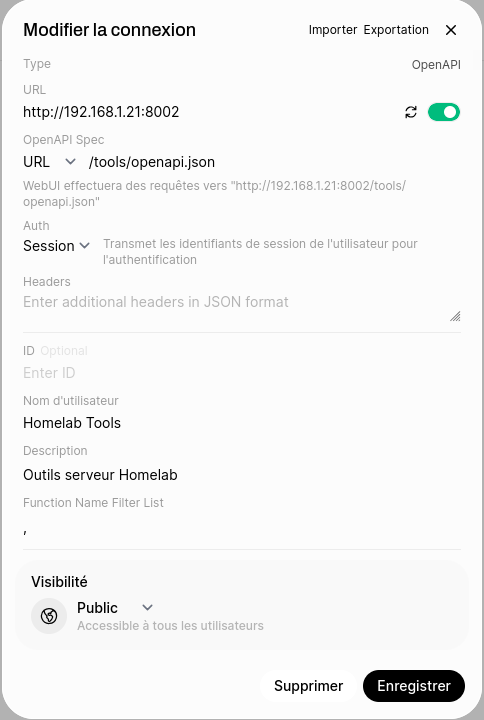

Complete configuration for connecting MCParr to Open WebUI as an OpenAPI tool provider.

**Dialog: "Modifier la connexion" (Edit Connection)**

**Form Fields:**
1. **Type**: OpenAPI (selected from dropdown)
2. **URL**: http://192.168.1.21:8002
   - This is your MCParr backend URL
   - Toggle: ✓ Enabled (green)
3. **OpenAPI Spec**: 
   - URL dropdown: `/tools/openapi.json` (selected)
   - WebUI info text: "WebUI effectuera des requêtes vers 'http://192.168.1.21:8002/tools/openapi.json'"
4. **Auth**: Session (dropdown)
   - Description: "Transmet les identifiants de session de l'utilisateur pour l'authentification"
5. **Headers**: 
   - Placeholder: "Enter additional headers in JSON format"
6. **ID**: Optional
   - Placeholder: "Enter ID"
7. **Nom d'utilisateur** (Username): Homelab Tools
8. **Description**: Outils serveur Homelab
9. **Function Name Filter List**: (empty field)
10. **Visibilité** (Visibility):
    - **Public** (selected with checkmark)
    - Description: "Accessible à tous les utilisateurs"

**Actions:**
- **Supprimer** (Delete): Remove connection
- **Enregistrer** (Save): Save configuration

**Import/Export:**
- **Importer** (Import): Import connection config
- **Exportation** (Export): Export connection config

### Step-by-Step Setup

**1. Access Open WebUI Admin Panel**
- Open Open WebUI (e.g., http://localhost:3000)
- Go to **Settings** → **Admin Settings** → **Tools** (or **Outils**)

**2. Add New Connection**
- Click **"+ Add Tool"** or **"+ Nouvelle Connexion"**
- The dialog shown in the screenshot will appear

**3. Configure Connection**
Fill in the form as shown:
```
Type: OpenAPI
URL: http://YOUR_MCPARR_IP:8000
OpenAPI Spec: /tools/openapi.json
Auth: Session
Username: MCParr Homelab Tools
Description: Outils serveur Homelab
Visibility: Public
```

**Important Notes:**
- Use **port 8000** (API port), NOT 8001 (MCP port)
- For Docker setups:
  - macOS/Windows: Use `http://host.docker.internal:8000`
  - Linux: Use your machine's IP (e.g., `http://192.168.1.21:8000`)
- The OpenAPI spec auto-loads from `/tools/openapi.json`
- Auth "Session" passes Open WebUI user session for authentication

**4. Save and Test**
- Click **Enregistrer** (Save)
- Open WebUI will fetch the OpenAPI spec
- You should see a success message
- Tools will appear in the tools menu

**5. Enable Tools in Chat**
- Start a new chat in Open WebUI
- Click the **tools icon** (🔧 wrench) in chat input
- You'll see MCParr tools grouped by category
- Toggle on the tools you want to use
- Start chatting with AI control of your homelab!

### Available Tools

Once connected, Open WebUI will have access to 112 MCP tools across all services:

**System (7 tools)**
- Get system status
- List services
- Health checks
- Metrics

**Plex (6 tools)**
- get_libraries
- search_media
- get_recently_added
- get_on_deck
- get_playback_info
- get_library_stats

**Overseerr**
- Request movies
- Request TV shows
- Check status

**Radarr/Sonarr**
- Add movies/series
- Search content
- Monitor downloads

**And 10+ more services...**

### Example Conversations

```
You: What sci-fi movies do I have?
AI: [Uses plex_search tool with genre=sci-fi]
    You have 47 sci-fi movies including:
    - Interstellar
    - The Matrix
    - Inception
    - Blade Runner 2049
    - Dune
```

```
You: Request the latest season of The Expanse
AI: [Uses overseerr_request_tv tool]
    ✅ I've requested The Expanse Season 6 via Overseerr.
    It will be downloaded and added to Plex automatically
    once available.
```

```
You: How are my downloads?
AI: [Uses radarr and sonarr status tools]
    Currently downloading:
    • 3 movies in Radarr queue (720p)
    • 5 TV episodes in Sonarr queue (1080p)
    • All downloads healthy, no errors
    • Estimated completion: 2 hours
```

---

## Tips & Best Practices

### Services Management
- ✅ Test connection immediately after adding services
- ✅ Use descriptive names to differentiate multiple instances
- ✅ Enable health check monitoring for critical services
- ✅ Review test results to troubleshoot connectivity issues
- ✅ Use **Service Groups** to organize related services

### User Management
- ✅ Use auto-detection to quickly map users across services
- ✅ Create groups with meaningful names (Admin, Family, Guest)
- ✅ Assign least-privilege permissions (only needed tools)
- ✅ Review group permissions regularly

### Tool Chains
- ✅ Start with simple chains before building complex workflows
- ✅ Use context variables to pass data between steps
- ✅ Test chains with edge cases (empty results, errors)
- ✅ Document chain logic for future reference

### Global Search
- ✅ Enable only frequently used services for faster results
- ✅ Set priority order based on your usage patterns
- ✅ Use category filters for targeted searches

### AI Training
- ✅ Start with **Modelfile (rapide)** for quick testing
- ✅ Use **Fine-tuning GPU** for production models
- ✅ Organize prompts by service and difficulty
- ✅ Export prompts regularly as backup
- ✅ Monitor training loss curves for quality

### Monitoring & Alerts
- ✅ Enable auto-refresh (10s) for real-time monitoring
- ✅ Create alert rules for critical thresholds
- ✅ Review logs regularly to identify patterns
- ✅ Export logs for long-term analysis
- ✅ Set up error rate alerts
- ✅ Configure webhook notifications for Slack/Discord

### Open WebUI Integration
- ✅ Use **Auto-Configure** for quick setup
- ✅ Set visibility to "Public" for team access
- ✅ Enable only needed tools to reduce clutter
- ✅ Test each tool individually before deployment
- ✅ Use **Service Group** mode for organized tool access

### Configuration
- ✅ Backup configuration before major changes
- ✅ Use dark theme to reduce eye strain
- ✅ Enable backend logging for debugging
- ✅ Set appropriate log levels (Info for production)
- ✅ Export configuration periodically
- ✅ Use the **Help** button when exploring new features

---

## Troubleshooting

### Service Connection Issues

**Symptom**: Service shows "Hors ligne" (Offline) or test fails

**Solutions**:
1. Verify service is running: `docker ps` or service status
2. Check URL is correct and accessible from MCParr host
3. Verify API key is valid (check service settings)
4. Test network connectivity: `ping service.local` or `curl http://service:port`
5. Check firewall rules allow connection
6. Review service logs for authentication errors

### Open WebUI Tools Not Appearing

**Symptom**: No MCParr tools visible in Open WebUI

**Solutions**:
1. Verify MCParr backend is accessible: `curl http://YOUR_IP:8000/health`
2. Check OpenAPI spec loads: `curl http://YOUR_IP:8000/tools/openapi.json`
3. Ensure **port 8000** (API), not 8001 (MCP)
4. Verify Auth is set to "Session"
5. Try refreshing Open WebUI page (Ctrl+R)
6. Check Open WebUI logs for connection errors

### Training Session Fails

**Symptom**: Session shows "failed" status in red

**Solutions**:
1. Check GPU worker is online and accessible
2. Verify sufficient GPU memory (check worker metrics)
3. Review training logs for specific error:
   - Click failed session → View logs
4. Try **Modelfile (rapide)** method instead
5. Reduce batch size if OOM errors
6. Check Ollama server is running on worker

### Logs Not Displaying

**Symptom**: Log viewer shows 0 logs or missing entries

**Solutions**:
1. Enable "Logs backend" in Configuration → Logs
2. Set log level to "All levels" to see everything
3. Check backend is running: `docker logs mcparr`
4. Verify database is writable
5. Generate activity (visit pages, test services)
6. Refresh page manually

### High Memory Usage

**Symptom**: Memory bar shows red (>80%)

**Solutions**:
1. Check which services are memory-intensive
2. Restart MCParr container: `docker restart mcparr`
3. Reduce Redis cache size in environment
4. Disable unused services
5. Monitor for memory leaks in logs

### Auto-Refresh Not Working

**Symptom**: Dashboard doesn't update automatically

**Solutions**:
1. Enable auto-refresh toggle in settings
2. Check interval is set (10s recommended)
3. Verify WebSocket connection: Browser DevTools → Network → WS
4. Clear browser cache
5. Try different browser

---

## Keyboard Shortcuts

**General**
- `Ctrl+K` or `Cmd+K`: Open command palette (if available)
- `Ctrl+R` or `Cmd+R`: Refresh page
- `Esc`: Close dialogs/modals

**Navigation**
- `1-7`: Jump to main navigation items
  - `1`: Dashboard
  - `2`: Services
  - `3`: Users
  - `4`: MCP Server
  - `5`: Training IA
  - `6`: Monitoring
  - `7`: Configuration

---

## Help System

MCParr includes an integrated help system accessible throughout the interface.

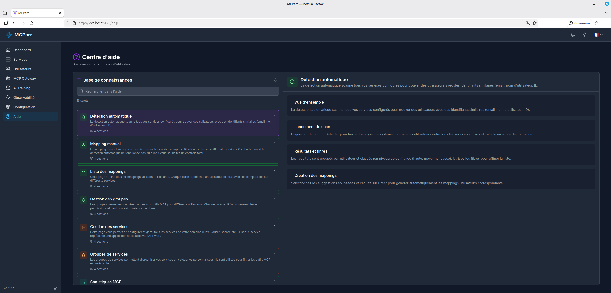

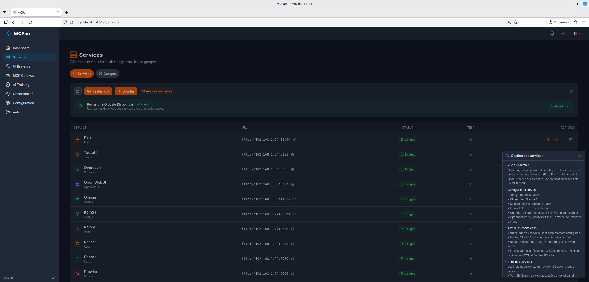

### Accessing Help

Look for the **? Help** button in the top-right corner of most pages. Click it to open contextual help for the current section.

### Help Panel Features

- **Overview**: What this section does
- **Quick Start**: Step-by-step getting started guide
- **Features**: Key capabilities explained
- **Tips**: Best practices and recommendations
- **FAQ**: Common questions and answers

### Available Help Topics

| Section | Help Topics |
|---------|-------------|
| Dashboard | System overview, metrics explanation |
| Services | Adding services, testing connections |
| Service Groups | Organizing services, auto-configuration |
| Users | Auto-detection, group management |
| MCP | Tool statistics, endpoint modes |
| Tool Chains | Creating workflows, conditions |
| Global Search | Configuration, searchable services |
| AI Training | Sessions, workers, models, prompts |
| Monitoring | Metrics, logs, alerts |
| Configuration | Settings, backup/restore |

### First-Time Wizard

On first launch, MCParr displays a setup wizard:

1. **Language Selection**: Choose interface language (EN, FR, DE, ES, IT)
2. **Import Backup**: Optionally restore a previous configuration
3. **Feature Tour**: Interactive overview of all sections

The wizard can be re-accessed from **Configuration** → **General** → **Reset Wizard**.

---

## API Access

All web UI features are accessible via REST API:

**Base URL**: `http://localhost:8000`

**Key Endpoints**:
- `GET /health` - Health check
- `GET /api/services` - List services
- `POST /api/services` - Add service
- `GET /api/users` - List users
- `GET /api/groups` - List groups
- `GET /api/mcp/stats` - MCP statistics
- `GET /api/training/sessions` - Training sessions
- `GET /api/logs` - System logs

**API Documentation**: http://localhost:8000/docs (Swagger UI)

---

## Support

**Documentation**:
- 📘 [Installation Guide](INSTALLATION.md)
- ⚙️ [Configuration Guide](CONFIGURATION.md)
- 🔌 [MCP Integration](MCP.md)
- 🔗 [API Reference](API.md)

**Community**:
- 📘 [GitHub Repository](https://github.com/sharkhunterr/mcparr)
- 🐛 [Issue Tracker](https://github.com/sharkhunterr/mcparr/issues)
- 💬 [Discussions](https://github.com/sharkhunterr/mcparr/discussions)

**Need Help?**
1. Check documentation first
2. Search existing GitHub issues
3. Create new issue with:
   - MCParr version
   - Docker/Native deployment
   - Error logs
   - Steps to reproduce

---

**Last Updated**: January 2026
**MCParr Version**: 1.0.0
